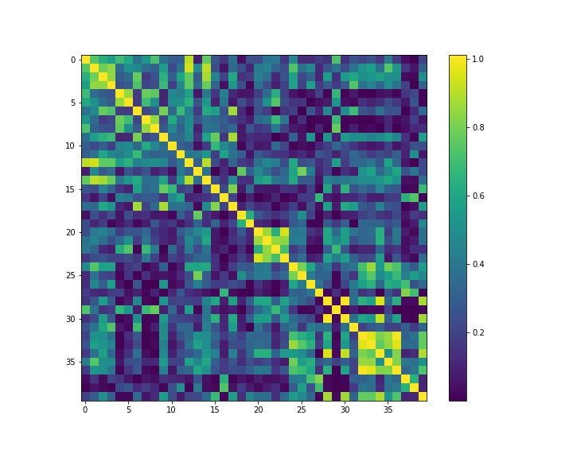

# Quantum Support Verctor Machine   

**This is NOT a original work. But a copy of this Qiskit example project presented by **Jin-Sung Kim**  
Source: https://www.youtube.com/watch?v=OKbcJCUx6xA .

## Training Result  

      
    
    
    This plot shows the training result of the quantum support machine model / algorithm on the 
    training set of **ad-hoc-dataset**. Color strength at each point represents the amplitude of
    the inner product of each pair of vectors in higher dimensional vector space mapped by the
    **ZZFeatureMap** quantum circuit from the Qiskit library.  
