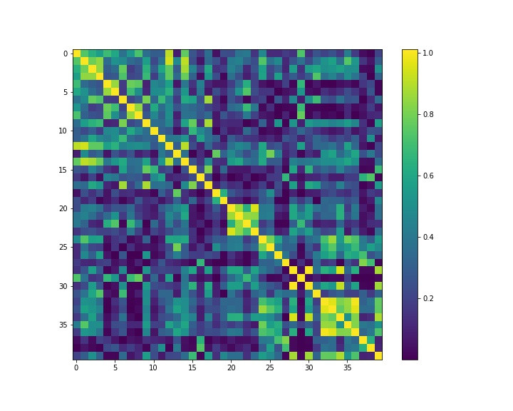

# Quantum Support Verctor Machine   

_This is NOT an original work. But a **COPY** of this Qiskit example project presented by **Jin-Sung Kim**  
Source: https://www.youtube.com/watch?v=OKbcJCUx6xA ._

## Training Result  

      
    
   
This plot shows the training result of the quantum support machine model / algorithm on the 
training set of **ad-hoc-dataset**. Color strength at each point represents the amplitude of
the inner product of each pair of vectors in higher dimensional vector space mapped by the
**ZZFeatureMap** quantum circuit from the Qiskit library.  

Diagonal elements: their values are one, because the inner product of a vector with itself is by definition one. eg. for vector |1> holds , |<1|1>|^2 = 1.0
Dark points: it is not diificult to see some dark points, if their exact value is zero. Means the corresponding two vectors are orthogonal to each other.  eg. for basis vectors |1>  and |2> holds , |<1|2>|^2 = 0.0 

... in progress ...
